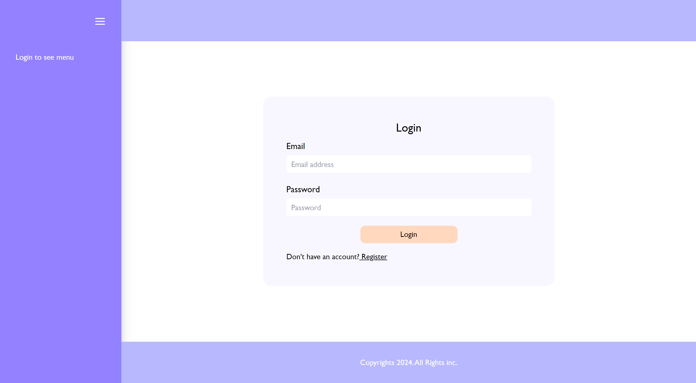
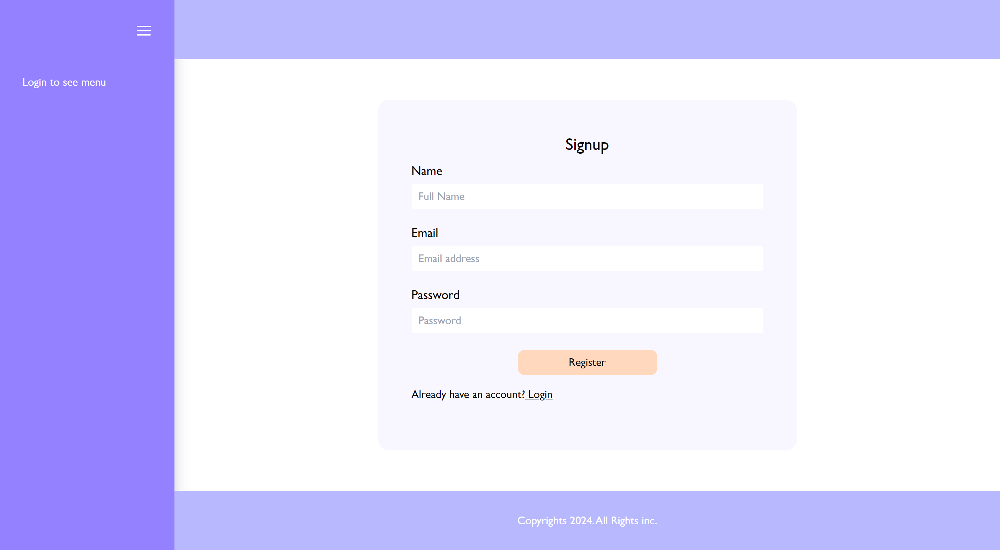
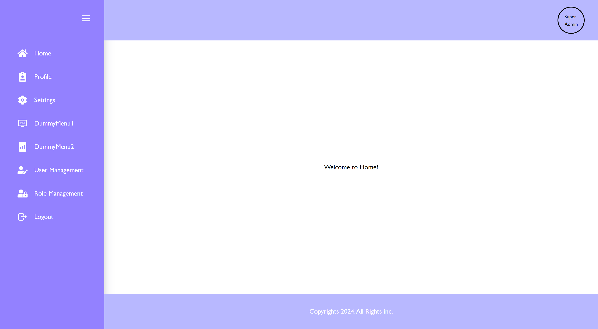
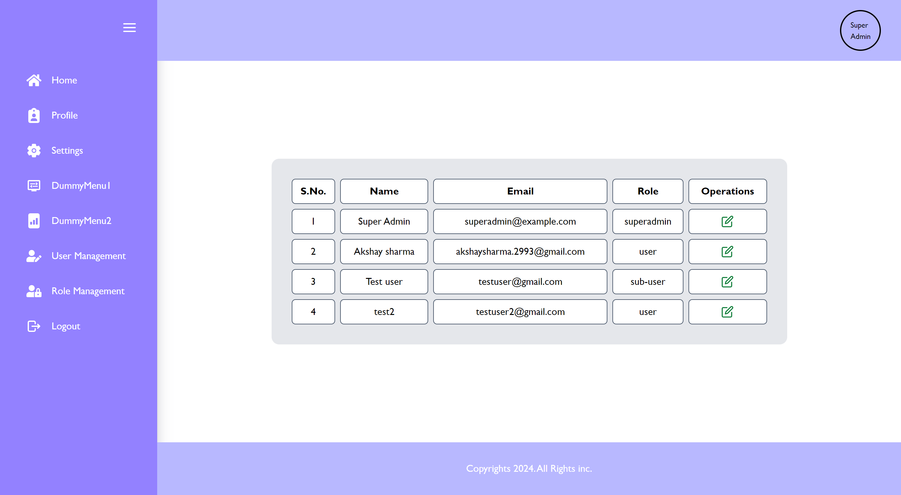
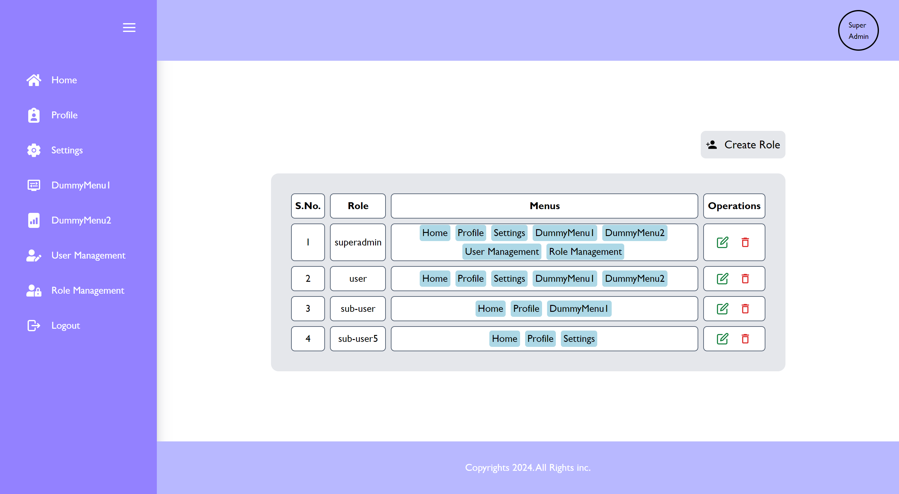
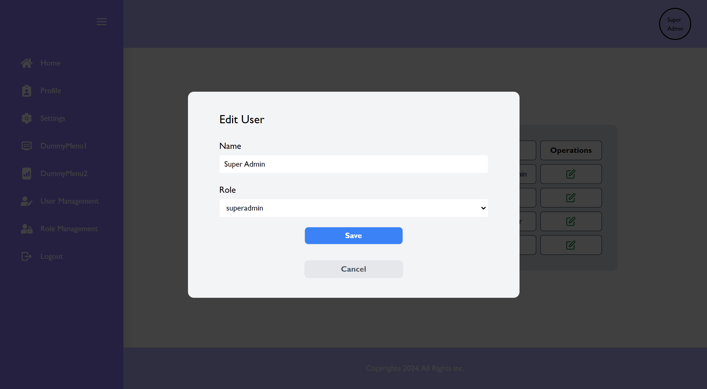
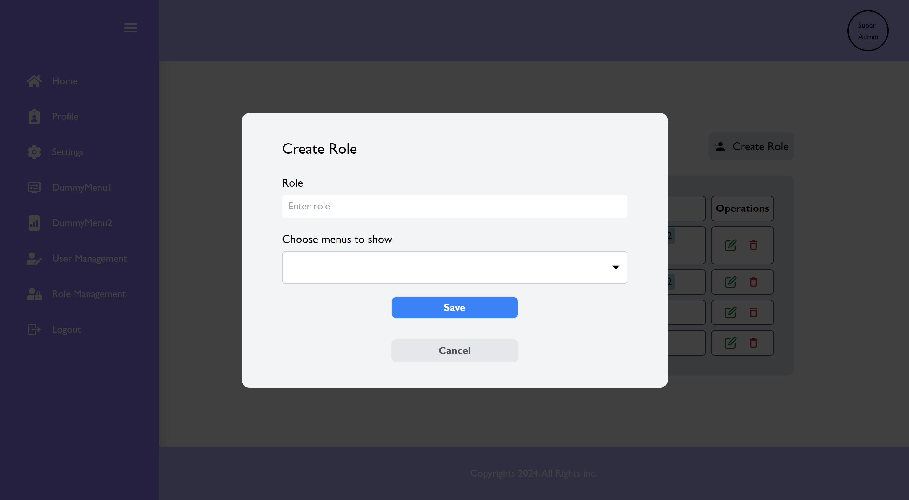
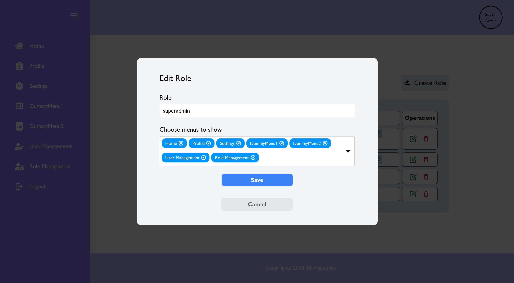
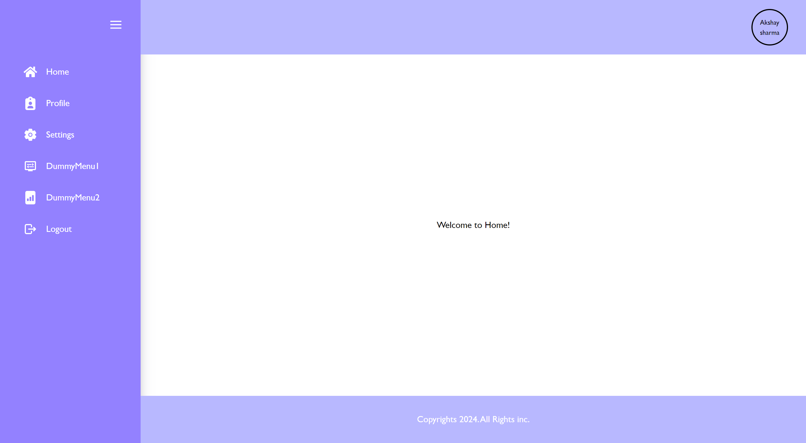

# CodeRootz-Technical_round-MERN-User_Management

Application Flow:

1.Shows a Login Screen by default

2.User can choose to login/signup

3.After Login the user is taken to Home screen

3.If logged in as Superadmin, the admin can access User-management/Role-management pages

4.In User Managment the admin can edit user-role

4.In Role Managment the admin can edit user-role or create a new role

5.When logged in as a user, can only view assigned menu items

6.The siddebar menu is collapsible

